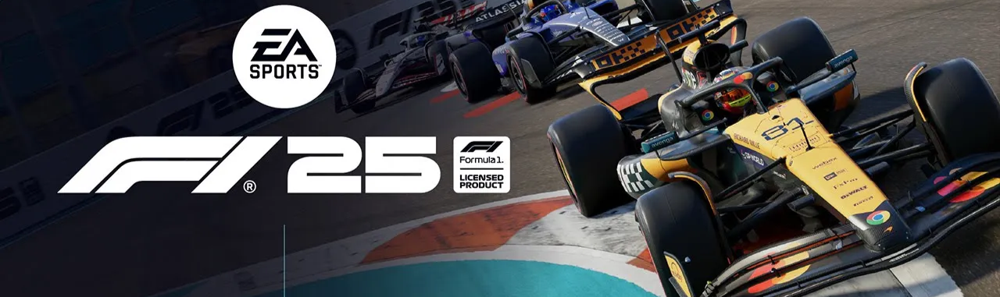

# 🏎️ F1 25 Telemetry Dashboard

<div align="center">


**Real-time telemetry dashboard for F1 25 (EA Sports) with full grid monitoring**

[Features](#-features) • [Installation](#-installation) • [Usage](#-usage) • [Documentation](#-documentation) • [Contributing](#-contributing)



</div>

## 🎯 Overview

F1 25 Telemetry Dashboard is an open-source, real-time telemetry application for EA Sports F1 25 and F1 24. It captures UDP telemetry data broadcasted by the game and displays comprehensive race information for all 22 drivers simultaneously in a modern web interface.

### Why This Project?

- 📊 **Complete Grid Overview**: Monitor all 22 drivers in real-time
- 🎮 **Game Integration**: Direct UDP connection with F1 25/24
- 📈 **Performance Analysis**: Track speed, lap times, tire temps, fuel, and more
- 🔧 **Modern Stack**: Built with React, TypeScript, and Node.js
- 🆓 **Free & Open Source**: No subscriptions or hidden fees

## ✨ Features

### Current Features (v1.0)
- ✅ **Real-time Telemetry**: Speed, throttle, brake, gear, steering
- ✅ **Lap Timing**: Current lap, last lap, best lap, sector times
- ✅ **Race Position**: Live standings with gaps and intervals
- ✅ **Car Status**: Fuel levels, tire compound and age, ERS deployment
- ✅ **Temperature Data**: Tire temps, brake temps, engine temperature
- ✅ **Session Info**: Weather, track temperature, session type
- ✅ **Multi-platform**: Works with PC, PlayStation, and Xbox

### Upcoming Features
- 📍 Live track map with car positions
- 📊 Performance graphs and charts
- 💾 Session recording and replay
- 📤 Data export (CSV/JSON)
- 🏁 Lap comparison tools
- 🎯 Strategy calculator
- 📱 Mobile responsive design

## 🚀 Installation

### Prerequisites
- [Node.js](https://nodejs.org/) v18 or higher
- [npm](https://www.npmjs.com/) or [yarn](https://yarnpkg.com/)
- F1 25 or F1 24 game (PC/PlayStation/Xbox)
- Same network connection for game and telemetry app

### Quick Start

1. **Clone the repository**
```bash
git clone https://github.com/yourusername/f1-25-telemetry.git
cd f1-25-telemetry
```

2. **Install dependencies**
```bash
npm install
```

3. **Start the application**
```bash
# Terminal 1 - Start the UDP server
npm run server

# Terminal 2 - Start the React dashboard
npm run dev
```

4. **Configure F1 25 Game**
- Go to `Settings` → `Telemetry Settings`
- Set `UDP Telemetry` to **ON**
- Set `UDP Broadcast Mode` to **OFF**
- Set `UDP IP Address` to your computer's IP (or `127.0.0.1` for same PC)
- Set `UDP Port` to **20777**
- Set `UDP Send Rate` to **20 Hz**
- Set `UDP Format` to **2025** (F1 25) or **2024** (F1 24)

5. **Open Dashboard**
- Navigate to [http://localhost:3000](http://localhost:3000)
- Start any session in F1 25
- Telemetry data will appear automatically!

## 📖 Usage

### Basic Operation

Once configured, the dashboard will automatically display telemetry data when you're in a session:

- **Your Car**: Highlighted in yellow
- **Position Tower**: Shows current standings
- **Telemetry Panel**: Real-time speed, gear, throttle, brake
- **Lap Times**: Current, last, and best lap times
- **Car Status**: Fuel, tires, temperatures, warnings

### Keyboard Shortcuts

- `Space` - Pause/Resume telemetry
- `R` - Reset session data
- `F` - Toggle fullscreen
- `D` - Toggle dark/light mode
- `S` - Save current session

### Network Setup

#### Same PC Setup
Set IP to `127.0.0.1` in game settings

#### Different PC Setup
1. Find your computer's IP address:
   - Windows: `ipconfig`
   - Mac/Linux: `ifconfig` or `ip addr`
2. Enter this IP in the game's telemetry settings

#### Console Setup (PlayStation/Xbox)
- Ensure console is on the same WiFi network
- Use your computer's local IP address
- May need to disable firewall temporarily

## 🏗️ Architecture

```
┌─────────────┐         ┌──────────────┐         ┌─────────────┐
│   F1 25     │  UDP    │  Node.js     │  HTTP   │   React     │
│   Game      ├────────►│  Server      ├────────►│  Dashboard  │
│             │ :20777  │              │ :3000   │             │
└─────────────┘         └──────────────┘         └─────────────┘
       │                        │                        │
       ▼                        ▼                        ▼
  UDP Packets              Parse & Store            Visualize
  (Binary Data)            (TypeScript)            (Components)
```

### Tech Stack

- **Frontend**: React 18, TypeScript, Vite, TailwindCSS
- **Backend**: Node.js, UDP dgram, Buffer parsing
- **State**: Zustand / Context API
- **Charts**: Recharts / D3.js
- **Testing**: Vitest, React Testing Library

## 📊 Telemetry Data

The game broadcasts various packet types at your configured rate:

| Packet Type | ID | Size | Description |
|------------|----|----|-------------|
| Motion | 0 | 1349 bytes | Position, velocity, G-forces |
| Session | 1 | 644 bytes | Weather, track, temperature |
| Lap Data | 2 | 1131 bytes | Lap times, positions, penalties |
| Event | 3 | 45 bytes | Race events (DRS, penalties) |
| Participants | 4 | 1306 bytes | Driver names, teams |
| Car Telemetry | 6 | 1352 bytes | Speed, throttle, brake, temps |
| Car Status | 7 | 1239 bytes | Fuel, tires, damage, ERS |

## 🔧 Configuration

### Environment Variables

Create a `.env` file in the root directory:

```env
# Server Configuration
UDP_PORT=20777
UDP_HOST=0.0.0.0

# Dashboard Configuration
VITE_API_URL=http://localhost:3001
VITE_UPDATE_RATE=20

# Features
VITE_ENABLE_RECORDING=true
VITE_ENABLE_EXPORT=true
```

### Custom Settings

Edit `config/settings.json`:

```json
{
  "server": {
    "port": 20777,
    "bufferSize": 2048,
    "timeout": 5000
  },
  "dashboard": {
    "refreshRate": 20,
    "maxDrivers": 22,
    "theme": "dark"
  }
}
```

## 🧪 Development

### Project Structure

```
f1-25-telemetry/
├── src/
│   ├── server/          # UDP server and packet parsing
│   ├── services/        # Business logic and parsers
│   ├── components/      # React components
│   ├── hooks/           # Custom React hooks
│   ├── types/           # TypeScript definitions
│   └── utils/           # Helper functions
├── tests/               # Test files
├── docs/                # Documentation
└── config/              # Configuration files
```

### Running Tests

```bash
# Run all tests
npm test

# Run with coverage
npm run test:coverage

# Run specific test
npm test HeaderParser
```

### Building for Production

```bash
# Build both frontend and backend
npm run build

# Start production server
npm start
```

## 📚 Documentation

- [UDP Protocol Specification](docs/UDP_PROTOCOL.md)
- [API Documentation](docs/API.md)
- [Component Guide](docs/COMPONENTS.md)
- [Contributing Guide](CONTRIBUTING.md)

## 🤝 Contributing

We welcome contributions! Please see our [Contributing Guide](CONTRIBUTING.md) for details.

### How to Contribute

1. Fork the repository
2. Create your feature branch (`git checkout -b feature/AmazingFeature`)
3. Commit your changes (`git commit -m 'Add some AmazingFeature'`)
4. Push to the branch (`git push origin feature/AmazingFeature`)
5. Open a Pull Request

### Development Setup

```bash
# Install dependencies
npm install

# Run in development mode
npm run dev:all

# Run linter
npm run lint

# Format code
npm run format
```

## 🐛 Troubleshooting

### Common Issues

**No data appearing?**
- Check if UDP Telemetry is enabled in game
- Verify IP address and port settings
- Check firewall settings
- Ensure both devices are on same network

**High latency?**
- Reduce UDP Send Rate to 10Hz
- Check network congestion
- Close other applications

**Connection refused?**
- Port might be in use: `netstat -an | grep 20777`
- Try a different port
- Restart both game and application

## 📄 License

This project is licensed under the MIT License - see the [LICENSE](LICENSE) file for details.

## 🙏 Acknowledgments

- EA Sports for F1 25 and the UDP telemetry feature
- Codemasters for the original telemetry implementation
- The sim racing community for testing and feedback
- All contributors who have helped improve this project

## 📞 Support

- **Issues**: [GitHub Issues](https://github.com/yourusername/f1-25-telemetry/issues)
- **Discussions**: [GitHub Discussions](https://github.com/yourusername/f1-25-telemetry/discussions)
- **Discord**: [Join our server](https://discord.gg/f1telemetry)
- **Email**: support@f1telemetry.dev

## 🔗 Links

- [F1 25 Official Site](https://www.ea.com/games/f1/f1-25)
- [UDP Specification](https://answers.ea.com/t5/General-Discussion/F1-24-UDP-Specification/td-p/13745220)
- [Project Website](https://f1telemetry.dev)
- [Demo Video](https://youtube.com/watch?v=demo)

---

<div align="center">

**Made with 💛 by Hugo Rafael**

If you find this project useful, please consider giving it a ⭐ on GitHub!

</div>